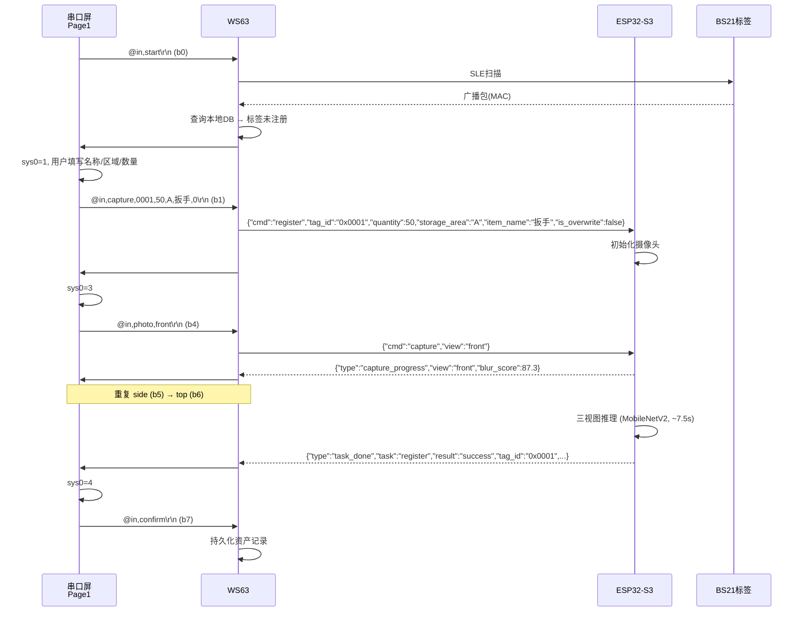
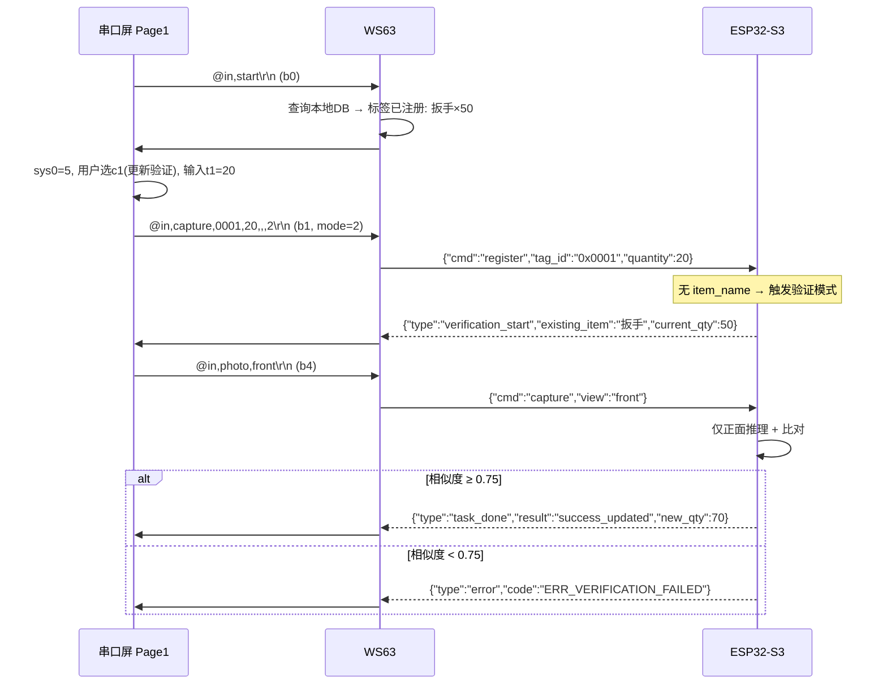
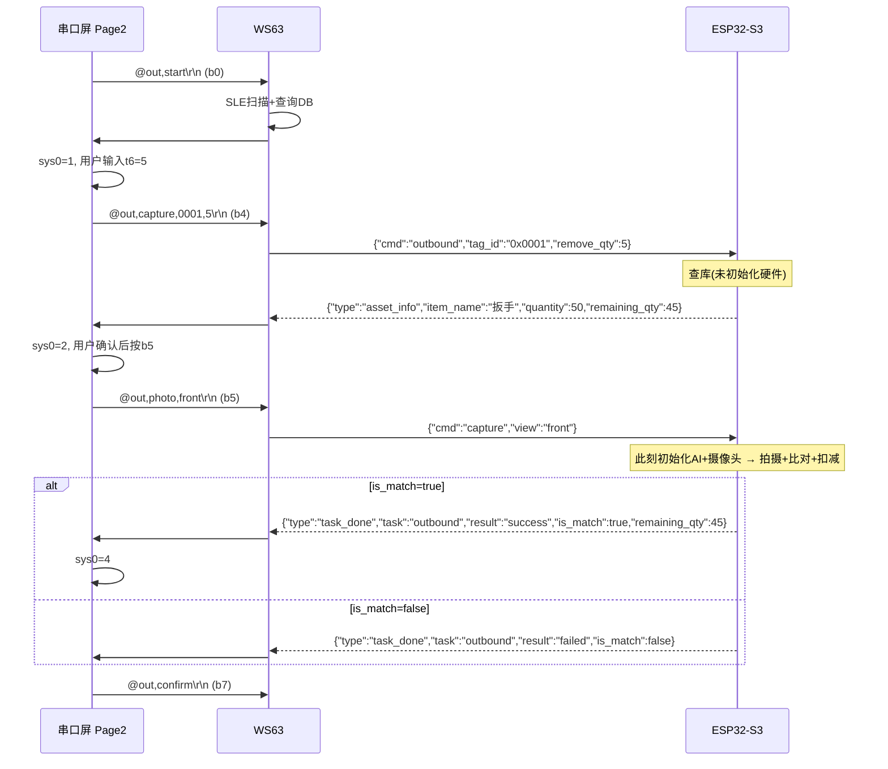
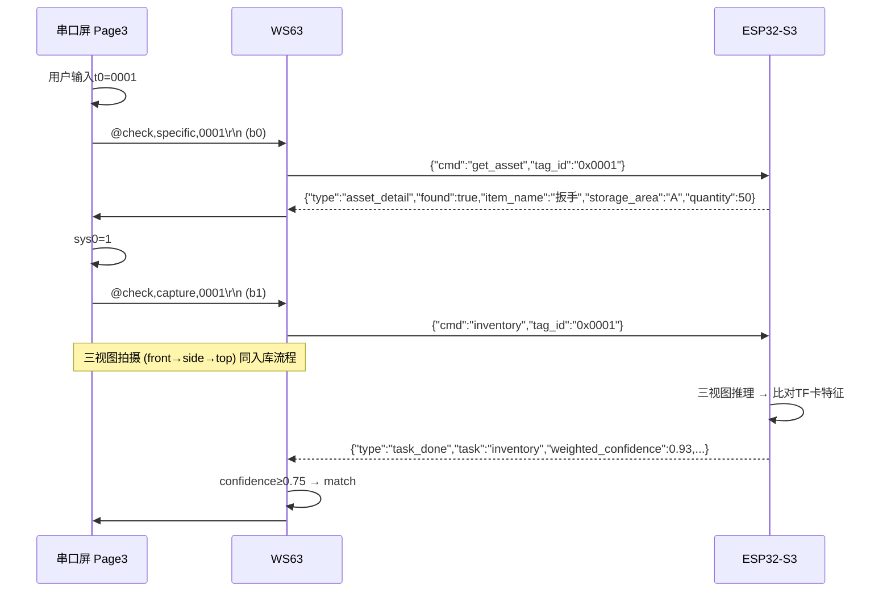
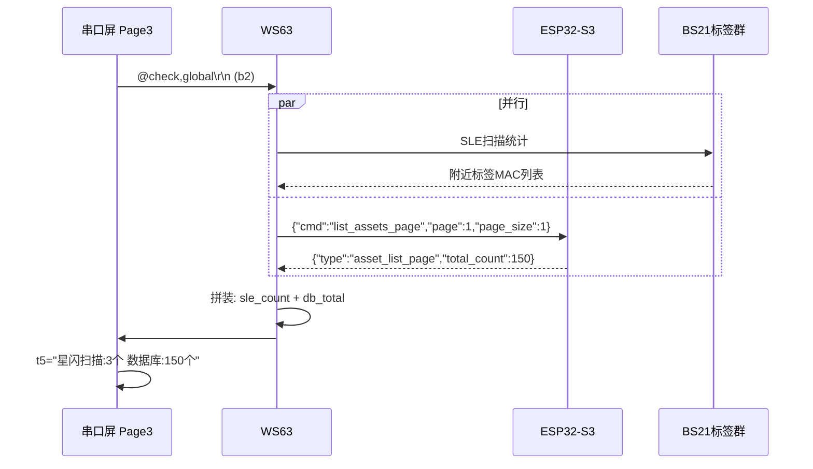
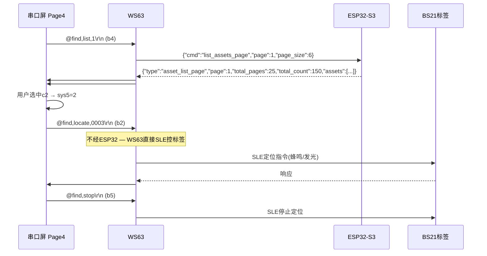

# 星闪双模资产盘点系统 — 端到端通信协议汇总

> **文档版本**: v1.0  
> **最后更新**: 2026-05-26  
> **适用项目**: 星闪双模资产盘点系统  
> **定位**: 入口文档 — 汇总三端通信全貌、核心流程、映射表  
> **详细参考**: 字段定义和完整规范请查阅各专业文档

---

## 文档导航

| 文档 | 路径 | 职责 |
|------|------|------|
| **END_TO_END_PROTOCOL.md** (本文档) | `docs/END_TO_END_PROTOCOL.md` | 入口：流程图、映射表、对照表 |
| PROTOCOL.md v3.3 | `docs/PROTOCOL.md` | WS63↔ESP32 UART1 JSON 协议完整规范 |
| WS63_UART_屏协议_Page1-4.md v2.2 | `docs/WS63_UART_屏协议_Page1-4.md` | WS63↔串口屏 UART2 CSV 协议完整规范 |
| 串口屏端侧代码汇总.md | `docs/串口屏端侧代码汇总.md` | 淘晶驰T1端侧控件、变量、事件代码 |

---

## 一、系统拓扑

```
                              ┌──────────────┐
                              │   MQTT Cloud │ (ThingsKit)
                              └──────┬───────┘
                                     │ WiFi / 4G(L610备选)
                                     │
┌──────────────┐    UART2 (CSV)  ┌───┴───────────┐    UART1 (JSON)   ┌─────────────────┐
│  淘晶驰 T1   │◄──────────────►│     WS63       │◄───────────────►│    ESP32-S3     │
│  4.3寸串口屏  │  @屏→WS63     │  (星闪网关)     │  WS63→ESP32     │  (视觉感知节点)  │
│  recmod=1    │  #WS63→屏      │                │  ESP32→WS63     │                 │
│  baud=115200 │  \r\n结尾      │  SLE ↔ BS21    │  \n结尾          │  UART2 ↔ L610   │
└──────────────┘                └───────┬────────┘                  └────────┬────────┘
                                        │                                    │
                                        │ SLE (NearLink)                AT Commands
                                        │                                    │
                                 ┌──────┴──────┐                    ┌───────┴───────┐
                                 │  BS21 ×N    │                    │  L610 4G模块   │
                                 │ (SLE电子标签)│                    │ (MQTT备选上云) │
                                 └─────────────┘                    └───────────────┘
```

### 硬件接线一览

| 链路 | 接口 | WS63引脚 | 对端引脚 | 波特率 | 帧尾 |
|------|------|---------|---------|--------|------|
| WS63 ↔ ESP32-S3 | UART1 | TX→RX(GPIO18), RX←TX(GPIO17) | + GPIO2(RTC唤醒) | 115200 | `\n` |
| WS63 ↔ 串口屏 | UART2 | TX→RX, RX←TX | — | 115200 | `\r\n` |
| ESP32-S3 ↔ L610 | UART2 | — | GPIO4(TX)→RX, GPIO5(RX)←TX | 115200 | AT指令 |

---

## 二、版本兼容性矩阵

| 部件 | 当前版本 | 协议文档版本 | Tag ID 格式 | 关键特性 |
|------|---------|-------------|------------|---------|
| ESP32-S3 固件 | v3.3 | PROTOCOL.md v3.3 | `0x0001` (含0x前缀) | 验证式更新、分步出库、分页列表、ping心跳 |
| WS63 固件 | dev | CLAUDE.md v1.0 | `0x0001` (内部) | SLE扫描+连接、Tag映射表、NV持久化 |
| 串口屏固件 | v1.0 | 屏协议 v2.2 | `0001` (不含0x前缀) | 4页面: 入库/出库/盘点/查找 |
| BS21标签 | — | — | MAC地址 (硬件) | SLE广播+通知+深度休眠 |

### Tag ID 跨端转换规则

```
屏 → WS63:    "0001"     (纯数字，无0x前缀)
WS63 内部:    "0x0001"   (统一标准格式)
WS63 → ESP32: "0x0001"   (含0x前缀，符合PROTOCOL.md)
ESP32 内部:   "0x0001"   (文件命名、存储索引)
ESP32 → WS63: "0x0001"   (JSON字段值)
WS63 → 屏:    "0001"     (去0x前缀，屏端直接显示)
```

> **WS63职责**: Tag ID 格式双向转换（屏↔ESP32之间的 `0x` 前缀加/去）。

---

## 三、协议分层总览

```
┌─────────────────────────────────────────────────────────┐
│                     应用层 (Business Logic)              │
│   WS63 business_logic: 入库/出库/盘点/查找 状态机        │
├─────────────────────────────────────────────────────────┤
│              协议转换层 (WS63 核心职责)                   │
│   CSV帧 ←→ JSON命令 互转                                │
│   Tag ID 格式互转 (0001 ↔ 0x0001)                       │
│   屏状态机 ↔ ESP32状态机 桥接                            │
├──────────────┬──────────────────────┬───────────────────┤
│  UART2 (CSV) │    UART1 (JSON)      │  SLE (NearLink)   │
│  WS63↔屏     │    WS63↔ESP32        │  WS63↔BS21        │
│  帧头: @/#   │    帧尾: \n          │  广播+连接+通知    │
│  帧尾: \r\n  │    格式: JSON Lines   │  SSAP协议         │
│  屏buf: 1024B│    最大: 2048B        │  UUID: FF00/FF01  │
└──────────────┴──────────────────────┴───────────────────┘
```

---

## 四、业务流程图 (Mermaid 序列图)

### 4.1 入库 — 新资产注册 (Mode A)



### 4.2 入库 — 验证式更新 (Mode B)



### 4.3 出库



### 4.4 盘点 — 特定资产AI比对



### 4.5 盘点 — 全局统计



### 4.6 资产查找与定位



---

## 五、全命令与帧格式速查表

### 5.1 下行命令：屏按钮 → WS63 → ESP32 完整映射

| 页面 | 屏按钮 | 屏→WS63上行帧 | WS63→ESP32 JSON命令 | ESP32响应类型 |
|------|--------|-------------|-------------------|-------------|
| **入库** | b0 扫描标签 | `@in,start\r\n` | WS63本地SLE扫描 | `#TAG` / `#VERIFY` |
| | b1 启动(mode=0) | `@in,capture,<id>,<qty>,<area>,<name>,0\r\n` | `register` + `is_overwrite:false` | `task_done`(register) |
| | b1 覆写(mode=1) | `@in,capture,<id>,<qty>,<area>,<name>,1\r\n` | `register` + `is_overwrite:true` | `task_done`(register) |
| | b1 验证(mode=2) | `@in,capture,<id>,<qty>,,,2\r\n` | `register`(仅tag_id+quantity) | `verification_start` → `task_done` |
| | b4/b5/b6 拍照 | `@in,photo,<view>\r\n` | `capture` | `capture_progress` |
| | b7 确认 | `@in,confirm\r\n` | WS63本地持久化 | — |
| **出库** | b0 扫描 | `@out,start\r\n` | WS63本地SLE扫描 | `#TAG` |
| | b4 启动 | `@out,capture,<id>,<qty>\r\n` | `outbound` | `asset_info` → `task_done` |
| | b5 拍照 | `@out,photo,front\r\n` | `capture` | `capture_progress` |
| | b7 确认 | `@out,confirm\r\n` | WS63本地持久化 | — |
| **盘点** | b0 特定 | `@check,specific,<id>\r\n` | `get_asset` | `asset_detail` |
| | b1 启动比对 | `@check,capture,<id>\r\n` | `inventory` | `asset_info` → `capture_progress` → `task_done` |
| | b2 全局 | `@check,global\r\n` | WS63本地(SLE+ `list_assets_page`) | `#INV`(本地拼装) |
| | b4/b5/b6 拍照 | `@check,photo,<view>\r\n` | `capture` | `capture_progress` |
| **查找** | b4 获取列表 | `@find,list,<page>\r\n` | `list_assets_page` | `asset_list_page` |
| | b0/b1 翻页 | `@find,list,<page>\r\n` | `list_assets_page` | `asset_list_page` |
| | b2 定位 | `@find,locate,<id>\r\n` | ⚠️ WS63→SLE (不经ESP32) | `#LOCATE` |
| | b5 停止 | `@find,stop\r\n` | ⚠️ WS63→SLE (不经ESP32) | — |

### 5.2 上行消息：ESP32 → WS63 → 串口屏 完整映射

| ESP32→WS63 JSON | WS63→屏 CSV帧 | 屏端显示位置 |
|----------------|-------------|------------|
| `task_done`(register, success) | `#DONE,reg,success,<id>\r\n` | Page1 t5, sys0=4 |
| `task_done`(register, success_updated) | `#DONE,reg,success_updated,<id>\r\n` | Page1 t5, sys0=4 |
| `task_done`(outbound, is_match=true) | `#DONE,out,success\r\n` | Page2 t5, sys0=4 |
| `task_done`(outbound, is_match=false) | `#DONE,out,fail\r\n` | Page2 t5 |
| `task_done`(inventory) | WS63判断confidence≥0.75 → `#DONE,check,match,<conf>\r\n` | Page3 t5 |
| `capture_progress` | `#PROG,<step>,<view>,<score>\r\n` | t4=步骤, t5=清晰度 |
| `asset_info`(outbound) | `#ASSET_INFO,<id>,<name>,<qty>,<remove>,<remain>\r\n` | Page2 t7, sys0=2 |
| `asset_detail` / `asset_info`(inventory) | `#TAG_INFO,<id>,<name>,<area>,<count>\r\n` | Page3 t1 |
| `asset_list_page` | `#LIST,<p>,<tp>,<tc>\r\n` + 逐条 `#ITEM,<s>,...\r\n` | Page4 t0-t7 |
| `verification_start` | (可选)`#MSG,请拍摄正面视图验证\r\n` | Page1 t5 |
| `error` | `#ERR,<code>,<msg>\r\n` | 各页t5/t8 |
| `pong` | (可选)`#MSG,...` 或仅日志 | — |

### 5.3 WS63本地下行帧（不经ESP32）

| WS63→屏 CSV帧 | 触发时机 | 屏端行为 |
|--------------|---------|---------|
| `#TAG,<id>\r\n` | SLE扫描到未注册标签(in) | Page1 t0=id, sys0=1 |
| `#TAG,<id>,<name>,<area>,<total>\r\n` | SLE扫描到已注册标签(out) | Page2 t0/t3/t2/t1, sys0=1 |
| `#VERIFY,<id>,<name>,<area>,<qty>\r\n` | SLE扫描到已注册标签(in) | Page1 t0/t3/t2, t1="count", sys0=5 |
| `#INV,<sle_count>,<db_total>\r\n` | 全局盘点完成 | Page3 t5 |
| `#LOCATE,<status>,<id>\r\n` | 标签响应/超时 | Page4 b2.txt/t8 |
| `#MSG,<text>\r\n` | 通用通知 | 各页t5/t8 |

---

## 六、WS63处理逻辑汇总

### 6.1 核心处理函数映射

| 屏上行帧 CMD | WS63处理 | 说明 |
|-------------|---------|------|
| `@in,start` / `@out,start` | SLE扫描 → 查本地DB → 发`#TAG`或`#VERIFY` | RSSI取最强标签 |
| `@in,capture,mode=0/1/2` | 根据mode拼装`register` JSON | mode决定`is_overwrite`和是否含`item_name` |
| `@out,capture` | 拼装`outbound` JSON | `remove_qty`来自屏t6 |
| `@check,specific` | 拼装`get_asset` JSON | |
| `@check,capture` | 拼装`inventory` JSON | |
| `@check,global` | WS63本地: SLE扫描 + `list_assets_page` | 并行获取双端数据 |
| `@find,list` | 拼装`list_assets_page` JSON | `page_size=6` |
| `@find,locate` | WS63→SLE直接控BS21蜂鸣 | 不经ESP32 |
| `@find,stop` | WS63→SLE停止定位 | 不经ESP32 |
| `@*,photo,<view>` | 拼装`capture` JSON | 透传view参数 |

### 6.2 ESP32上行处理映射

| ESP32上行 type | WS63处理 |
|---------------|---------|
| `capture_progress` | 提取step(取分子)、view、blur_score → `#PROG` |
| `task_done`(register) | result → `#DONE,reg,<result>,<tag_id>` |
| `task_done`(outbound) | 检查`is_match` → `#DONE,out,success/fail` |
| `task_done`(inventory) | `confidence≥0.75` → `#DONE,check,match/mismatch,<conf>` |
| `asset_info`(outbound) | → `#ASSET_INFO` (含remaining_qty) |
| `asset_detail` / `asset_info`(inventory) | → `#TAG_INFO` |
| `asset_list_page` | → `#LIST` + 逐条`#ITEM` |
| `verification_start` | 可选转`#MSG`提醒或仅日志 |
| `error` | → `#ERR,<code>,<msg>` |
| `pong` | 可选日志 |

---

## 七、错误码跨层映射

| ESP32错误码 (PROTOCOL.md §9) | WS63→屏 `#ERR` 帧 | 建议屏端提示 |
|-----------------------------|------------------|------------|
| `ERR_INVALID_JSON` | `#ERR,ERR_INVALID_JSON,...` | 内部错误，请重试 |
| `ERR_UNKNOWN_CMD` | `#ERR,ERR_UNKNOWN_CMD,...` | 内部错误，请重试 |
| `ERR_MISSING_FIELD` | `#ERR,ERR_MISSING_FIELD,...` | 请填写完整信息 |
| `ERR_INVALID_TAG_ID` | `#ERR,ERR_INVALID_TAG_ID,...` | Tag ID格式错误 |
| `ERR_ASSET_NOT_FOUND` | `#ERR,ERR_ASSET_NOT_FOUND,...` | 标签未注册 |
| `ERR_ASSET_ALREADY_EXISTS` | `#ERR,ERR_ASSET_ALREADY_EXISTS,...` | 标签已存在 |
| `ERR_STORAGE_NOT_READY` | `#ERR,ERR_STORAGE_NOT_READY,...` | 存储异常 |
| `ERR_CAMERA_FAIL` | `#ERR,ERR_CAMERA_FAIL,...` | 摄像头故障 |
| `ERR_AI_MODEL_FAIL` | `#ERR,ERR_AI_MODEL_FAIL,...` | AI模块故障 |
| `ERR_CAPTURE_FAIL` | `#ERR,ERR_CAPTURE_FAIL,...` | 拍摄失败 |
| `ERR_BLUR_DETECTED` | `#ERR,ERR_BLUR_DETECTED,...` | 图像模糊，请重拍 |
| `ERR_INFERENCE_FAIL` | `#ERR,ERR_INFERENCE_FAIL,...` | 推理失败 |
| `ERR_SAVE_FAIL` | `#ERR,ERR_SAVE_FAIL,...` | 保存失败 |
| `ERR_VERIFICATION_FAILED` | `#ERR,ERR_VERIFICATION_FAILED,物品不匹配` | 物品不匹配 |
| `ERR_LOW_CONFIDENCE` | `#ERR,ERR_LOW_CONFIDENCE,...` | 置信度过低 |
| `ERR_TIMEOUT` | `#ERR,ERR_TIMEOUT,...` | 操作超时 |

---

## 八、关键常量与限制

| 参数 | 值 | 来源 |
|------|-----|------|
| 串口屏缓冲区 | 1024 字节 (T1系列限制) | 屏协议 §1.2 |
| 串口屏单帧建议 | ≤200 字节 | 屏协议 §9.1 |
| ESP32 JSON帧最大 | 2048 字节 | PROTOCOL.md §4.2 |
| MQTT Payload最大 | 1024 字节 | PROTOCOL.md §18.2 |
| 串口屏连续帧间隔 | ≥10ms | 屏协议 §9.3 |
| 串口屏定时器周期 | 50ms (`tim=50`) | 端侧代码汇总 §2 |
| Tag ID 范围 | `0x0001` - `0xFFFF` (65000+) | PROTOCOL.md §6.1 |
| 资产列表每页条数 | 6 | 屏协议 §5 |
| SLE扫描重启间隔 | 5秒 / 10秒 | WS63 main.c |
| MQTT心跳间隔 | 60秒 | PROTOCOL.md §19.1 |
| AT指令超时 | 5秒 | PROTOCOL.md §19.1 |
| AT重试次数 | 3次 | PROTOCOL.md §18.1 |
| 相似度阈值 | 0.75 | PROTOCOL.md §6.1 |
| 模糊度阈值 | 80分 | PROTOCOL.md |
| 特征向量维度 | 1280维 | PROTOCOL.md §7.2 |
| 推理耗时 | ~1.2s/帧 | README |
| 完整注册耗时 | ~7.5秒 (三视图) | README |
| 验证式更新耗时 | ~2.5秒 (仅正面) | README |

---

## 九、状态机对照

| sys0 | 含义 | Page1 入库 | Page2 出库 | Page3 盘点 | Page4 查找 |
|:----:|------|:----:|:----:|:----:|:----:|
| 0 | 空闲/初始 | b0可用 | b0可用 | b0,b2可用 | b4可用 |
| 1 | 信息已获取 | b0,b1可用 | b0,b4可用 | b0,b1,b2可用 | b0,b1,b2,b5,c0-c5可用 |
| 2 | 已发capture/outbound | b0可用 | b0,b5可用 | b0,b2可用 | — |
| 3 | 拍摄中 | b0,b4,b5,b6可用 | b0可用 | b4,b5,b6可用 | — |
| 4 | 推理完成待确认 | b0,b7可用 | b0,b7可用 | b0,b2可用 | — |
| 5 | 验证模式(仅入库) | b0,b1可用 | — | — | — |

> Page4额外变量: `sys3`=当前页码, `sys4`=总页数, `sys5`=选中slot(0-5/99)

---

## 十、ESP32命令速查（WS63开发者视角）

| 命令 | 格式 | 可在BUSY时执行 | 典型响应 |
|------|------|:---:|---------|
| `register` | `{"cmd":"register","tag_id":"0x0001",...}` | ❌ | `task_done`(register) |
| `inventory` | `{"cmd":"inventory","tag_id":"0x0001"}` | ❌ | `asset_info` → `capture_progress`×N → `task_done` |
| `outbound` | `{"cmd":"outbound","tag_id":"0x0001","remove_qty":5}` | ❌ | `asset_info` → `task_done` |
| `capture` | `{"cmd":"capture","view":"front"}` | ❌ | `capture_progress` |
| `delete` | `{"cmd":"delete","tag_id":"0x0001"}` | ❌ | `task_done`(delete) |
| `cancel` | `{"cmd":"cancel"}` | ✅ 唯一在BUSY可用的业务命令 | `task_done`(cancelled) |
| `get_asset` | `{"cmd":"get_asset","tag_id":"0x0001"}` | ✅ | `asset_detail` |
| `ping` | `{"cmd":"ping"}` | ✅ | `pong` |
| `list_assets_page` | `{"cmd":"list_assets_page","page":1,"page_size":6}` | ❌ | `asset_list_page` |
| `sys_info` | `{"cmd":"sys_info"}` | ❌ | `system_info` |

---

## 十一、维护策略

1. **版本更新时**：先更新本文档的"版本兼容性矩阵"（§二），再更新各专业文档。
2. **新增页面/命令时**：在本文档 §五（速查表）和 §四（序列图）同步添加。
3. **屏端控件变更时**：同步更新"串口屏端侧代码汇总.md"。
4. **ESP32命令字段变更时**：同步更新 PROTOCOL.md 和本文档 §六（WS63处理逻辑）。
5. **三份文档同一字段必须使用相同命名**：
   - ESP32 JSON: `item_name`、`storage_area`、`quantity`、`remove_qty`
   - WS63→屏 CSV: `name`、`area`、`count`/`qty`
   - 命令名: `register`、`inventory`、`outbound`、`get_asset`、`list_assets_page`

---

**维护者**: TcXc  
**反馈邮箱**: 202500201056@stumail.sztu.edu.cn
