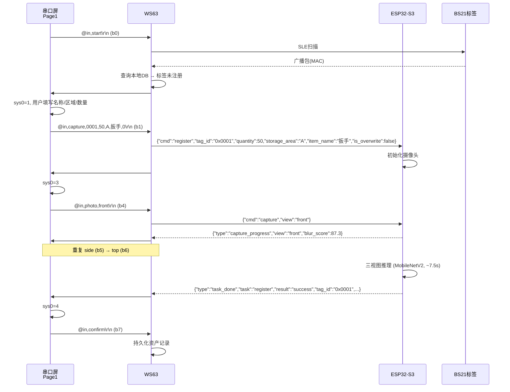
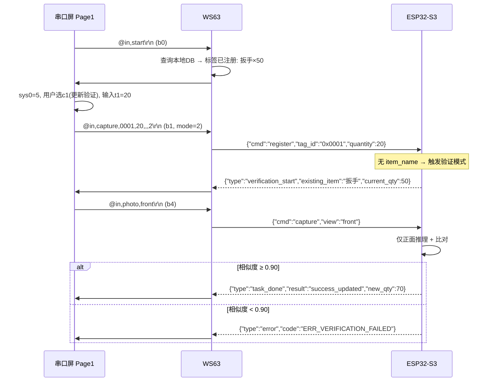
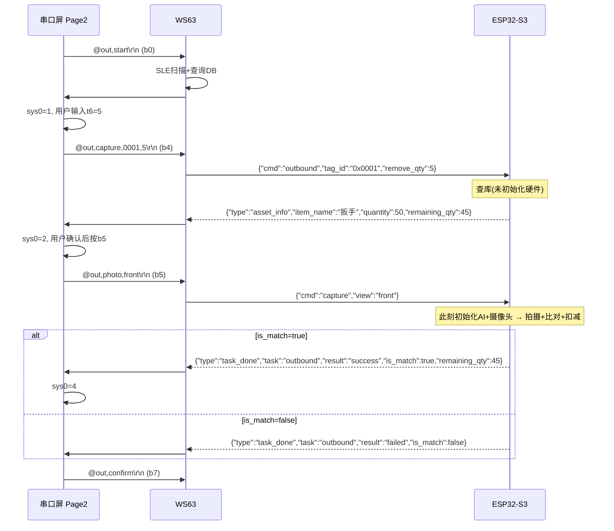
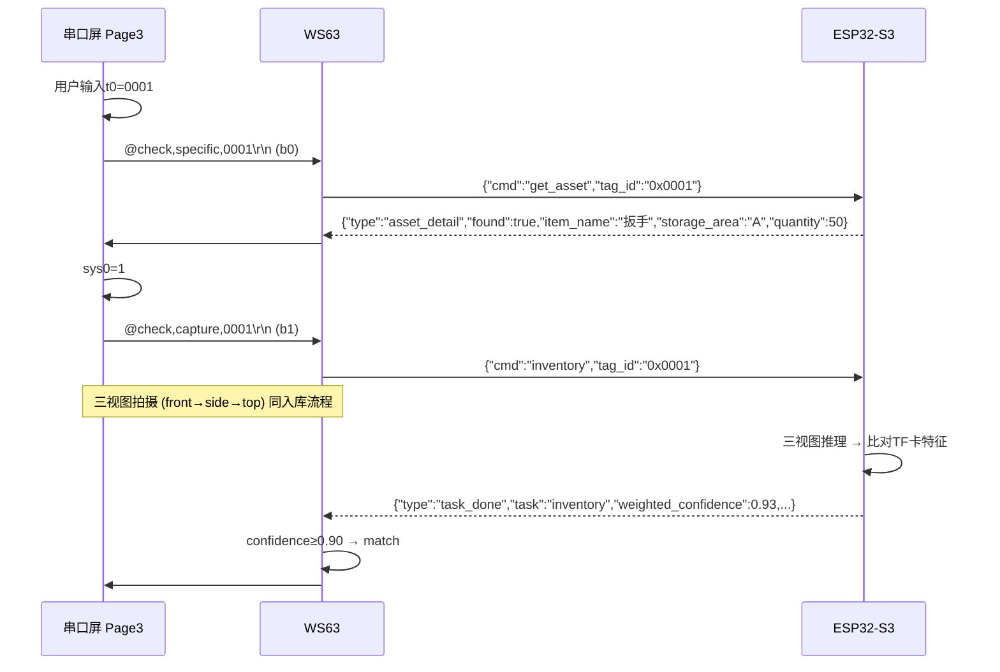
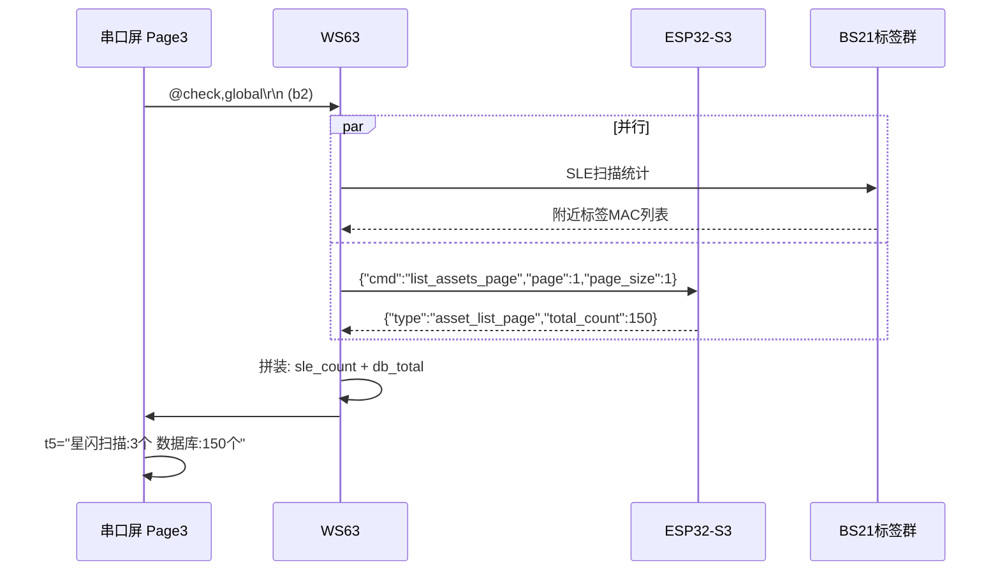
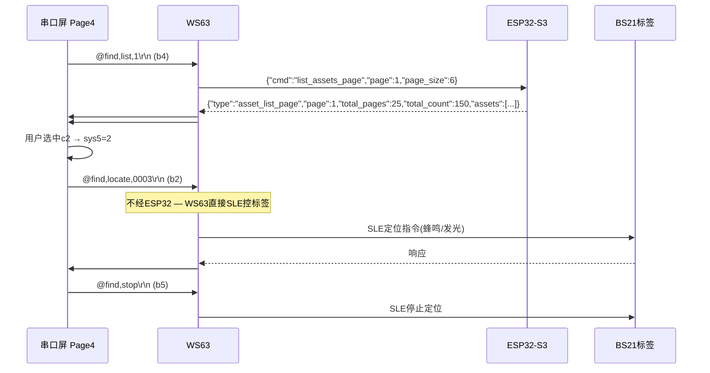

# 星闪双模资产盘点系统 — 完整架构文档

> **作者**: TcXc  
> **生成日期**: 2026-06-04  
> **适用项目**: WS63 星闪网关 + ESP32-S3 视觉感知节点 + 淘晶驰T1串口屏 + BS21E电子标签  
> **本文档定位**: 全系统端到端架构参考手册，涵盖代码结构、协议栈、数据流、状态机、模块依赖

---

## 目录

1. [系统拓扑](#一系统拓扑)
2. [硬件接线表](#二硬件接线表)
3. [WS63 端架构](#三ws63-端架构)
4. [ESP32-S3 端架构](#四esp32-s3-端架构)
5. [串口屏端架构](#五串口屏端架构)
6. [BS21E 电子标签](#六bs21e-电子标签)
7. [协议分层与帧格式](#七协议分层与帧格式)
8. [Tag ID 跨端转换规则](#八tag-id-跨端转换规则)
9. [核心业务流程](#九核心业务流程)
10. [状态机对照表](#十状态机对照表)
11. [全命令速查表](#十一全命令速查表)
12. [错误码映射表](#十二错误码映射表)
13. [数据持久化方案](#十三数据持久化方案)
14. [云平台对接](#十四云平台对接)
15. [关键常量与性能指标](#十五关键常量与性能指标)
16. [架构约束与铁律](#十六架构约束与铁律)
17. [迭代规划](#十七迭代规划)

---

## 一、系统拓扑

```
                              ┌──────────────┐
                              │  ThingsKit   │
                              │  MQTT 云平台  │
                              └──────┬───────┘
                                     │ WiFi (主) / 4G-L610 (备选)
                                     │
┌──────────────┐    UART2 (CSV)  ┌───┴───────────┐    UART1 (JSON)   ┌─────────────────────┐
│  淘晶驰 T1   │◄──────────────►│     WS63       │◄───────────────►│     ESP32-S3        │
│  4.3寸串口屏  │  @屏→WS63     │  (星闪网关)     │  WS63→ESP32     │  (视觉感知节点)      │
│  recmod=1    │  #WS63→屏      │                │  ESP32→WS63     │                     │
│  baud=115200 │  \r\n结尾      │  SLE ↔ BS21    │  \n结尾          │  UART2 ↔ L610       │
└──────────────┘                └───────┬────────┘                  └────────┬────────────┘
                                        │                                    │
                                        │ SLE (NearLink)                AT Commands
                                        │                                    │
                                 ┌──────┴──────┐                    ┌───────┴───────┐
                                 │  BS21E ×N   │                    │  L610 4G模块   │
                                 │ (SLE电子标签)│                    │ (MQTT备选上云) │
                                 └─────────────┘                    └───────────────┘
```

**五端职责一览：**

| 编号 | 设备 | 芯片/型号 | 角色 | 通信接口 |
|:----:|------|-----------|------|----------|
| 1 | **WS63** | HiSilicon WS63E | 星闪网关核心，协议转换枢纽，业务编排 | — |
| 2 | **ESP32-S3** | Espressif ESP32-S3R8 | AI 视觉感知节点，资产管理 | UART1 (JSON) |
| 3 | **淘晶驰 T1** | 4.3寸 480×272 串口屏 | 人机交互界面 (HMI) | UART2 (CSV) |
| 4 | **BS21E ×N** | HiSilicon BS21E | SLE 电子标签，资产附着 | SLE NearLink |
| 5 | **L610 4G** | Quectel L610 | 4G 备选上云通道 | AT 指令 (透传) |

---

## 二、硬件接线表

| 链路 | 接口 | WS63 引脚 | 对端引脚 | 波特率 | 帧尾 | 电平 |
|------|------|-----------|----------|--------|------|------|
| WS63 ↔ ESP32-S3 | UART1 | TX→RX (GPIO15), RX←TX (GPIO16) | GPIO47(TX), GPIO21(RX) + GPIO2 (RTC唤醒) | 115200 | `\n` | 3.3V TTL |
| WS63 ↔ 串口屏 | UART2 | TX→RX (GPIO8, mode2), RX←TX (GPIO7, mode2) | 屏端 TX/RX | 115200 | `\r\n` | 3.3V TTL |
| ESP32-S3 ↔ L610 | UART2 | — | GPIO4(TX)→L610 RX, GPIO5(RX)←L610 TX | 115200 | AT指令 | 3.3V TTL |
| WS63 ↔ BS21E | SLE | 内置天线 | 内置天线 | — | 广播+连接 | RF |
| WS63 ↔ WiFi AP | WiFi 2.4G | 内置天线 | AP | — | TCP/IP | RF |

---

## 三、WS63 端架构

### 3.1 目录结构

```
src/application/samples/peripheral/My_project_63/
├── CMakeLists.txt                          # 构建定义 (13个源文件 + 6个公共头目录)
├── Kconfig                                 # menuconfig: MY_PROJECT_63_ENABLE_STARTUP_LOG
├── CLAUDE.md                               # 开发规范 (500+行完整架构约束)
├── ws63_bs21e_coordination_spec.md         # WS63↔BS21E 联调规范
│
├── app/
│   └── main.c                              # 入口 + My63Task 事件驱动主循环 + 回调桥接 (359行)
│
├── components/
│   ├── shared_protocol/                    # 二进制协议编解码
│   │   ├── shared_protocol.h               #   - 大端序 packed 结构体定义
│   │   └── shared_protocol.c               #   - adv 解包、inventory/bind 解析、write_cmd 打包
│   │
│   ├── sle_network/                        # SLE (NearLink) 网络层
│   │   ├── sle_network.h                   #   - 扫描/连接/配对/SSAP API
│   │   └── sle_network.c                   #   - ~980行，广播去重、消息队列、扫描表管理
│   │
│   ├── uart_vision/                        # UART1 JSON 通信 (ESP32)
│   │   ├── uart_vision.h                   #   - DMA+IDLE 中断接收，cJSON 解析
│   │   └── uart_vision.c                   #   - ~350行，JSON Lines 协议
│   │
│   ├── uart_display/                       # UART2 CSV 通信 (串口屏)
│   │   ├── uart_display.h                  #   - DMA+IDLE 中断接收，CSV 帧解析
│   │   └── uart_display.c                  #   - ~400行，Tag ID 格式转换
│   │
│   ├── cloud_storage/                      # WiFi + MQTT + 离线缓存
│   │   ├── cloud_storage.h                 #   - ThingsKit 网关模式
│   │   └── cloud_storage.c                 #   - ~675行，WiFi 连接、MQTT 发布/订阅、NV 持久化
│   │
│   └── business_logic/                     # 业务逻辑核心
│       ├── business_logic.h                #   - 公共 API + 数据结构定义
│       ├── business_logic_internal.h       #   - 内部接口 (各子模块间共享)
│       ├── biz_core.c                      #   - 核心: pending 管理、NV 读写、回调分发
│       ├── biz_tag_map.c                   #   - 标签映射表 CRUD + MQTT 上云
│       ├── biz_esp32_cmd.c                 #   - ESP32 下行命令编码
│       ├── biz_esp32_resp.c                #   - ESP32 上行响应解码
│       ├── biz_screen_cmd.c                #   - 串口屏命令处理 + 状态机
│       ├── biz_wifi_mqtt.c                 #   - WiFi/MQTT 命令接口
│       └── biz_sle.c                       #   - SLE 回调处理 + 广播数据处理
│
└── document/
    ├── protocols/
    │   └── WS63_uart_protocol.md           # 串口屏 CSV 协议规范
    └── fix/                                 # 10+ 份修复/设计文档
```

### 3.2 模块依赖关系（架构铁律）

```
                    ┌─────────────┐
                    │  app/main.c │ ← 唯一耦合点，注册所有回调桥接
                    └──────┬──────┘
                           │ 回调函数指针
          ┌────────────────┼────────────────┐
          │                │                │
          ▼                ▼                ▼
   ┌──────────────┐ ┌──────────────┐ ┌──────────────┐
   │ uart_vision  │ │ uart_display │ │ cloud_storage│
   │ (UART1 JSON) │ │ (UART2 CSV)  │ │ (WiFi+MQTT)  │
   └──────┬───────┘ └──────┬───────┘ └──────▲───────┘
          │                │                │
          │   uv_cmd_handler_t             │ cs_mqtt_publish
          │   ud_cmd_handler_t             │ (通过回调指针)
          │                │                │
          └────────┐       └────────┐       │
                   ▼                ▼       │
              ┌──────────────────────────┐  │
              │    business_logic        │──┘
              │  (biz_core / biz_tag_map │
              │   biz_esp32_cmd / _resp  │
              │   biz_screen_cmd         │
              │   biz_wifi_mqtt          │
              │   biz_sle)               │
              └───────────┬──────────────┘
                          │ 直接调用 (单向)
                          ▼
                   ┌──────────────┐
                   │ sle_network  │
                   │ (SLE扫描/连接)│
                   └──────────────┘
```

**架构铁律（不可违反）：**

1. **business_logic 禁止 `#include "cloud_storage.h"`** — 所有云端交互必须通过 `main.c` 注册的回调函数指针完成
2. **sle_network 禁止 `#include "business_logic.h"`** — SLE 层只通过 notify 回调向上通知
3. **uart_vision 禁止 `#include "business_logic.h"` 或 `"cloud_storage.h"`** — 只通过 `uv_cmd_handler_t` 回调分发命令
4. **uart_display 禁止 `#include "business_logic.h"` 或 `"cloud_storage.h"`** — 只通过 `ud_cmd_handler_t` 回调分发命令
5. **跨组件引用只允许单向**：`business_logic` → `sle_network`、`business_logic` → `uart_vision`（发送 ESP32 回复）、`business_logic` → `uart_display`（发送屏幕数据）
6. **唯一耦合点是 `app/main.c`**

### 3.3 uart_vision vs uart_display 职责划分

| 维度 | uart_vision | uart_display |
|------|-------------|--------------|
| UART 总线 | UART1 | UART2 |
| 对端设备 | ESP32-S3 | 4.3寸淘晶驰 T1 串口屏 |
| 协议格式 | JSON 文本帧，`\n` 分割 | CSV 文本帧，`@`/`#` 头，`\r\n` 尾 |
| 解析方式 | cJSON 解析 | 按逗号 split，首字节判断方向 |
| 回调类型 | `uv_cmd_handler_t` | `ud_cmd_handler_t` |
| Tag ID 格式 | `"0x0001"` 十六进制字符串 | `"0001"` 纯数字字符串 |
| 驱动模式 | DMA + IDLE 中断 | DMA + IDLE 中断（同模式，独立实例） |
| 环形缓冲区 | 2048 字节 | 1024 字节 |
| 单行最大 | 512 字节 | 256 字节 |
| TX/RX 引脚 | GPIO15/GPIO16 (mode1) | GPIO8/GPIO7 (mode2) |
| 日志前缀 | `[WS63_UART]` | `[WS63_DISP]` |

### 3.4 WS63 事件驱动架构

```
中断上下文 (bt_service / UART ISR)              主循环上下文 (My63Task, 优先级26)
─────────────────────────────────               ────────────────────────────────
                                                 
SLE 广播回调 (my63_seek_result_cb)               for (;;) {
  │                                                 uint32_t flags = osEventFlagsWait(
  ├─ memcpy → sle_adv_msg                              g_my63_events, EVENT_ALL,
  ├─ osMessageQueuePut() → 消息队列                       osFlagsWaitAny, 100ms);
  └─ osEventFlagsSet(EVENT_SLE_ADV) ──────────►     
                                                   if (flags & EVENT_UART1_RX) {
UART1 IDLE 中断 (DMA 搬运完成)                          uart_vision_poll();
  │                                                     // 解析 JSON 行 → cJSON_Parse
  └─ osEventFlagsSet(EVENT_UART1_RX) ──────────►         // → uv_cmd_handler_t 回调
                                                     
                                                   if (flags & EVENT_UART2_RX) {
UART2 IDLE 中断 (DMA 搬运完成)                          uart_display_poll();
  │                                                     // 按 \r\n 分割行 → CSV 解析
  └─ osEventFlagsSet(EVENT_UART2_RX) ──────────►         // → ud_cmd_handler_t 回调
                                                     
                                                    if (flags & EVENT_SLE_ADV) {
LiteOS 定时器 (50ms 周期)                                sle_adv_dequeue();
  │                                                     // 出队 → AD 解析 → 扫描表更新
  └─ osEventFlagsSet(EVENT_TIMER) ─────────────►         biz_handle_sle_adv();
                                                         // 白名单判定 → 时间窗去重 → MQTT上云
                                                     
                                                   // 轮询类任务（每次循环都执行）
                                                   cloud_storage_poll();    // WiFi/MQTT 状态机
                                                   my63_poll_sle(now);      // SLE 扫描重启
                                                   business_logic_poll();   // pending 超时检查
                                                   my63_heartbeat(now);     // 30s 心跳日志
                                                 }
```

**事件标志位定义：**

```c
#define EVENT_SLE_ADV     (1U << 0)   // SLE 广播队列有数据
#define EVENT_UART1_RX    (1U << 1)   // UART1 (ESP32) 接收完成
#define EVENT_UART2_RX    (1U << 2)   // UART2 (串口屏) 接收完成
#define EVENT_TIMER       (1U << 3)   // 定时器事件（心跳/超时）
#define EVENT_ALL         (EVENT_SLE_ADV | EVENT_UART1_RX | EVENT_UART2_RX | EVENT_TIMER)
```

**中断上下文铁律：**
- 中断回调中**只做数据搬运 + 设置事件标志**，禁止阻塞或执行业务逻辑
- SLE 回调中**严禁** `osal_printk`、`shared_protocol_unpack_adv`、`scan_table_add_or_update`、cJSON 操作
- UART DMA+IDLE 中断中**严禁**使用传统的字节级 UART RX 中断

### 3.5 核心数据结构

#### 扫描表条目 (21 字节 packed)

```c
struct __attribute__((packed)) TagState {
    uint16_t tag_id;        // 2B  — 标签 ID
    uint8_t  mac[6];        // 6B  — MAC 地址
    uint8_t  battery;       // 1B  — 电池百分比
    uint16_t qty;           // 2B  — 广播中的数量字段
    uint8_t  status;        // 1B  — BS21E 原始状态 (0=空闲 1=寻物 2=使用中 3=未配网)
    uint64_t last_seen_ms;  // 8B  — 最后扫描时间戳
    bool     used;          // 1B  — 条目有效
};  // 总计 21B
```

#### 白名单 + 去重条目 (27 字节 packed × 32 = 864B)

```c
struct __attribute__((packed)) TagListEntry {
    uint8_t  mac[6];            // 6B  — 主键，用于匹配
    uint16_t tag_id;            // 2B  — 协议解析后填入
    uint64_t last_publish_ms;   // 8B  — 上次 MQTT 上云时间戳
    uint64_t last_seen_ms;      // 8B  — 最后扫描时间戳
    int8_t   rssi;              // 1B  — 最新信号强度
    bool     whitelisted;       // 1B  — 白名单标志（是否已注册）
    bool     used;              // 1B  — 条目有效
};  // 27B × 32 = 864B
```

#### SLE 广播消息 (约 80B，用于消息队列)

```c
struct __attribute__((packed)) sle_adv_msg {
    uint8_t  raw[64];      // 原始广播字节（AD data 完整内容）
    uint16_t raw_len;       // 有效字节长度
    uint8_t  addr[6];       // 发送方 MAC 地址
    int8_t   rssi;          // 信号强度
    uint64_t ts_ms;         // 入队时间戳
};
```

#### 标签映射表 (NV 持久化，~1154B)

```c
typedef struct {
    uint16_t tag_id;
    uint8_t  mac[6];
    char     zone[8];       // 仓库区域
    char     item[16];      // 货物名称
    uint16_t qty;           // 库存数量
    biz_tag_status_t status; // 0=空闲 1=已绑定 2=在线 3=离线
    uint8_t  battery;
} biz_tag_entry_t;

typedef struct {
    uint16_t count;
    biz_tag_entry_t entries[32];  // 最多 32 个标签
} biz_tag_map_t;
```

#### Pending 单槽

```c
typedef struct {
    char     cmd[16];        // 命令名
    uint16_t seq;            // 序列号
    uint16_t tag_id;         // 目标标签 ID
    bool     active;         // 是否激活
    uint64_t start_ms;       // 启动时间戳
    uint32_t timeout_ms;     // 超时: SLE=5000ms, ESP32=15000ms
} biz_pending_t;
```

### 3.6 SSAP 协议命令码

```c
#define SSAP_CMD_STOP_FIND      0x00   // 停止寻物
#define SSAP_CMD_FIND           0x01   // 寻物（蜂鸣/发光）
#define SSAP_CMD_INVENTORY      0x02   // 盘点（查询标签数据）
#define SSAP_CMD_UPDATE_QTY     0x10   // 更新数量
#define SSAP_CMD_BIND_TAG       0x20   // 绑定标签（注册）
#define SSAP_CMD_UNBIND_TAG     0x21   // 解绑标签

#define SSAP_RSP_INVENTORY      0x82   // 盘点响应
#define SSAP_RSP_BIND_OK        0xA0   // 绑定成功
#define SSAP_RSP_UNBIND_OK      0xA1   // 解绑成功
#define SSAP_RSP_BIND_FAIL      0xAF   // 绑定/解绑失败
```

### 3.7 SLE 广播处理流水线

```
osMessageQueueGet()
    │
    ▼
① 协议层解析
    │  从原始字节提取 manufacturer data → unpack_adv()
    │  unpack 失败 → 丢弃
    ▼
② 扫描表更新
    │  所有合法标签都写入 TagState 扫描表（无论是否已注册）
    ▼
③ 业务层分流（白名单判定）
    │
    ├─ 已注册 + MAC 匹配 → whitelisted = true → 继续 ④
    ├─ 已注册 + MAC 异常 → 标记异常，不上云，打印警告
    └─ 未注册           → whitelisted = false，不上云，仅保留在扫描表
    │
    ▼
④ 时间窗去重 (DEDUP_WINDOW_MS = 3000ms)
    │  同一 MAC 在 3 秒内已上云 → 仅更新 RSSI + 时间戳，跳过 ⑤
    ▼
⑤ MQTT 网关上云
    │  {"tag_%03u":[{...}]}
    ▼
⑥ 队列空 → 退出 poll，CPU 让出
```

**核心原则：扫描发现 ≠ 上云。白名单控制的是"谁能上云"，不是"谁能被看见"**

### 3.8 BS21E status → WS63 上云映射

| BS21E 原始值 | BS21E 含义 | WS63 上云值 | WS63 含义 |
|:-----------:|-----------|:---------:|----------|
| 0x00 | 空闲 (IDLE) | 2 | 在线 |
| 0x01 | 寻物中 (FINDING) | 2 | 在线 |
| 0x02 | 使用中 (IN_USE) | 2 | 在线 |
| 0x03 | 未配网 (NOT_PROVISIONED) | 0 | 空闲 |
| 超时未扫描到 | — | 3 | 离线 |
| 未注册 | — | 0 | 空闲 |

> **关键规则**：MQTT 上云时必须做映射转换，不能直接透传 BS21E 的 status 值。映射逻辑在 `biz_tag_map.c` 的 `biz_publish_tag_update()` 中。

### 3.9 SSAP 连接参数对齐

| 参数 | BS21E 值 | WS63 值 | 单位 | 实际时间 |
|------|----------|---------|------|----------|
| conn_interval | 0x64 | 0x64 | 0.625ms/slot | 62.5ms |
| conn_latency | 0x0F | N/A | slots | 最大静默 937.5ms |
| conn_timeout | 0x1F4 | 0x1F4 | 10ms | 5s |
| MTU | 默认(~300) | 512 | bytes | 协商取较小值 |
| CCCD 位置 | Property(0xFF01) | Property(0xFF01) | — | ✅ 已确认一致 |

### 3.10 NV 存储注册表

| NV Key | 所属模块 | 数据结构 | 大小 |
|--------|---------|---------|------|
| 0x5001 | business_logic | `biz_tag_map_t` (标签映射表) | ~1154B |
| 0x5002 | cloud_storage | `cs_mqtt_config_t` (MQTT 连接配置) | 320B |
| 0x5003 | cloud_storage | `cs_wifi_config_t` (WiFi 配置) | 98B |

> NV Key 范围：`[0x5000, 0xFFFF)`，单条上限 4060 字节。新增 NV 项必须在本文档登记。

---

## 四、ESP32-S3 端架构

### 4.1 目录结构

```
CAM_AI/
├── CMakeLists.txt                    # ESP-IDF CMake 项目
├── partitions.csv                    # 分区表
├── sdkconfig                         # menuconfig 配置
│
├── main/
│   ├── main.c                        # 应用入口（v3.6: ~132行），全局变量 + IPC + 任务创建
│   ├── main.h                        # app_context_t 定义，状态枚举，兼容宏，extern 声明
│   ├── app_handlers.c/.h             # ⭐v3.6: camera_ai_task + 8个handler + be_output_callback
│   │
│   └── modules/
│       ├── camera/
│       │   ├── camera_module.c/.h    # OV5640 摄像头驱动 + 帧抓取
│       │   └── pin_config.h          # DVP 引脚配置
│       │
│       ├── ai/
│       │   ├── ai_module.c/.h        # AI 推理编排
│       │   ├── mobilenet_wrapper.cpp/.h  # MobileNetV2 模型封装
│       │   ├── feature_processor.c/.h    # 多帧融合 (自适应1-3帧)
│       │   ├── similarity_matcher.c/.h   # 纯余弦相似度 (v3.5+), 阈值 0.90
│       │   ├── blur_detection.c/.h       # 拉普拉斯方差标准 Var(L), 阈值 50/150
│       │   └── inference_task.c/.h       # ⭐v3.6: 推理任务（从 main.c 拆分）
│       │
│       ├── system/
│       │   ├── executor/                 # ⭐v3.4: 业务执行器
│       │   │   └── business_executor.c/.h # 统一命令处理 + 双通道输出
│       │   ├── comm/                     # ⭐v3.4: 通信接口层
│       │   │   ├── uart_handler_0.c/.h   # UART0 CLI 文本处理器（调试）
│       │   │   └── uart_handler_1.c/.h   # UART1 WS63 JSON 处理器（生产）
│       │   ├── storage/                  # 存储子系统
│       │   │   ├── asset_manager.c/.h    # SD 卡资产 CRUD
│       │   │   ├── storage_module.c/.h   # 存储抽象层
│       │   │   └── storage_task.c/.h     # ⭐v3.6: 存储任务（从 main.c 拆分）
│       │   ├── verify/                   # ⭐v3.2: 验证模块
│       │   │   ├── tag_id_validator.c/.h # Tag ID 格式校验
│       │   │   ├── verify_handler.c/.h   # 身份验证逻辑
│       │   │   └── verify_config.h       # 验证配置
│       │   ├── led/                      # LED 指示层
│       │   │   └── led_indicator.c/.h    # WS2812 RGB LED 控制
│       │   └── abolished/               # 废弃代码归档
│       │
│       ├── 4g/
│       │   ├── l610_driver.c/.h          # L610 UART 驱动
│       │   ├── l610_manager.c/.h         # L610 MQTT 管理器
│       │   └── l610_mqtt.c/.h            # MQTT 原语
│       │
│       └── web/                          # ⭐v3.5: Web 调试层
│           ├── web_server.c/.h           # HTTP 服务器 (WiFi SoftAP)
│           ├── api_handlers.c/.h         # RESTful API
│           └── mjpeg_handler.c/.h        # MJPEG 视频流
│
├── components/
│   ├── esp-dl/
│   ├── esp32-camera/
│   └── ...
│
├── managed_components/
│   └── ...
│
└── docs/
    ├── README.md
    ├── QUICKSTART.md
    ├── USER_GUIDE.md
    ├── MONITOR_CODE.md
    ├── L610_DEBUG_GUIDE.md
    ├── PROTOCOL/
    │   ├── END_TO_END_PROTOCOL.md        # 端到端协议汇总 v1.2
    │   ├── ESP32_WS63_PROTOCOL.md        # WS63↔ESP32 JSON 协议 (v3.6)
    │   └── WS63_MONITOR_PROTOCOL.md      # WS63↔串口屏 CSV 协议 (v2.5)
    └── archive/                          # 历史文档归档
```

### 4.2 FreeRTOS 任务与队列

```
┌──────────────────────────────────────────────────────┐
│                   ESP32-S3 固件                       │
│                                                      │
│  ┌─────────────┐   ┌─────────────┐   ┌────────────┐ │
│  │ ws63_recv   │   │ 主状态机    │   │ 推理任务   │ │
│  │ _task       │   │ (main loop) │   │ (inference)│ │
│  │ (优先级 5)   │   │             │   │            │ │
│  │             │   │             │   │            │ │
│  │ UART1 RX    │──▶│ xSystemQueue│──▶│xInference  │ │
│  │ JSON 解析   │   │ 10条深度    │   │Queue       │ │
│  │ 命令分发    │   │ 命令处理    │   │ 推理结果   │ │
│  └─────────────┘   └─────────────┘   └────────────┘ │
│                          │                           │
│                          ▼                           │
│                    ┌─────────────┐                   │
│                    │ xStorage    │                   │
│                    │ Queue       │                   │
│                    │ 5条深度     │                   │
│                    │ SD卡读写    │                   │
│                    └─────────────┘                   │
│                                                      │
│  ┌──────────────────────────────────────────────┐   │
│  │ xCameraMutex (互斥锁)                         │   │
│  │ ⭐v3.6: 仅保护帧抓取(~50ms)，NN推理在锁外执行   │   │
│  └──────────────────────────────────────────────┘   │
└──────────────────────────────────────────────────────┘
```

### 4.3 全局状态枚举

**摄像头状态机 (15 个状态)：**

```c
typedef enum {
    CAM_STATE_WAITING_TAG_ID = 0,       // 主菜单状态，等待模式选择
    CAM_STATE_WAITING_REG_TAG_ID = 1,   // 等待注册 Tag ID
    CAM_STATE_WAITING_REG_NAME = 2,     // 等待输入物品名称
    CAM_STATE_WAITING_REG_AREA = 3,     // 等待输入存放区域
    CAM_STATE_WAITING_REG_QUANTITY = 4, // 等待输入数量
    CAM_STATE_VERIFYING_EXISTING = 5,   // 验证已存在的资产
    CAM_STATE_WAITING_VERIFY_CAPTURE = 6, // 等待拍摄正视图进行验证
    CAM_STATE_WAITING_REG_ADD_QTY = 7,  // 验证通过后等待输入累加数量
    CAM_STATE_WAITING_INV_TAG_ID = 8,   // 盘点 Tag ID
    CAM_STATE_WAITING_DEL_TAG_ID = 9,   // 删除 Tag ID
    CAM_STATE_WAITING_DEL_CONFIRM = 10, // 等待删除确认
    CAM_STATE_WAITING_OUT_TAG_ID = 11,  // 出库 Tag ID
    CAM_STATE_WAITING_OUT_QTY = 12,     // 等待出库数量
    CAM_STATE_READY_OUT = 13,           // 出库就绪状态
    CAM_STATE_READY = 14                // 就绪状态，可以拍摄
} camera_state_t;
```

**视图状态枚举：**

```c
typedef enum {
    VIEW_NONE = 0,
    VIEW_FRONT,      // 正面
    VIEW_SIDE,       // 侧面
    VIEW_TOP         // 顶部
} capture_view_t;
```

**盘点状态枚举：**

```c
typedef enum {
    INVENTORY_IDLE = 0,
    INVENTORY_WAITING_FRONT,
    INVENTORY_WAITING_SIDE,
    INVENTORY_WAITING_TOP,
    INVENTORY_ANALYZING,
    INVENTORY_COMPLETE
} inventory_state_t;
```

### 4.4 AI 推理流水线

```
┌─────────────────────────────────────────────────────────────────┐
│                      AI 推理流水线 (v3.6)                        │
│                                                                 │
│  输入: 三视图 (front / side / top)                               │
│                                                                 │
│  ┌──────────┐    ┌──────────┐    ┌──────────┐                  │
│  │ 正面拍摄  │    │ 侧面拍摄  │    │ 顶部拍摄  │                  │
│  │ 自适应1-3帧│   │ 自适应1-3帧│   │ 自适应1-3帧│                  │
│  └────┬─────┘    └────┬─────┘    └────┬─────┘                  │
│       │               │               │                         │
│       ▼               ▼               ▼                         │
│  ┌──────────┐    ┌──────────┐    ┌──────────┐                  │
│  │ 模糊检测  │    │ 模糊检测  │    │ 模糊检测  │                  │
│  │Var(L)阈值│    │Var(L)阈值│    │Var(L)阈值│                  │
│  │ 50/150   │    │ 50/150   │    │ 50/150   │                  │
│  └────┬─────┘    └────┬─────┘    └────┬─────┘                  │
│       │               │               │                         │
│       ▼               ▼               ▼                         │
│  ┌──────────────────────────────────────────┐                   │
│  │         MobileNetV2 推理                  │                   │
│  │         ~0.9 秒/帧                       │                   │
│  │         输出: 1280 维 GAP 特征向量        │                   │
│  └────────────────────┬─────────────────────┘                   │
│                       │                                         │
│                       ▼                                         │
│  ┌──────────────────────────────────────────┐                   │
│  │         纯余弦相似度匹配 (v3.5+)          │                   │
│  │         阈值: 0.90 (所有类别统一)         │                   │
│  └──────────────────────────────────────────┘                   │
│                                                                 │
│  典型耗时:                                                       │
│  - 完整注册 (三视图): ~8.5 秒                                   │
│  - 验证式更新 (仅正面): ~2.5 秒                                  │
└─────────────────────────────────────────────────────────────────┘
```

### 4.5 ESP32 命令类型枚举

```c
typedef enum {
    CMD_REGISTER = 0,         // 入库注册
    CMD_INVENTORY,            // 盘点比对
    CMD_OUTBOUND,             // 出库核验
    CMD_CAPTURE,              // 单步拍摄视图
    CMD_DELETE,               // 删除资产
    CMD_CANCEL,               // 取消当前任务 (唯一 BUSY 时可用的命令)
    CMD_LIST_ASSETS_PAGE,     // 分页查询资产列表
    CMD_GET_ASSET,            // 查询单个资产详情
    CMD_SYS_INFO,             // 查询系统信息
    CMD_PING,                 // 心跳/状态检测
    CMD_MQTT_CONNECT,         // 连接 MQTT 代理 (L610)
    CMD_MQTT_DISCONNECT,      // 断开 MQTT 连接 (L610)
    CMD_MQTT_PUBLISH,         // 通过 4G 发布 MQTT 消息 (L610)
    CMD_L610_STATUS,          // 查询 4G 模块状态
    CMD_L610_AT,              // AT 指令透传调试
} ws63_cmd_t;
```

---

## 五、串口屏端架构

### 5.1 硬件参数

| 参数 | 值 |
|------|-----|
| 型号 | 淘晶驰 T1 系列 |
| 尺寸 | 4.3 寸 |
| 分辨率 | 480 × 272 |
| 运行模式 | `recmod=1` (接收指令模式) |
| 波特率 | 115200 bps |
| 串口缓冲 | 1024 字节 |
| 定时器周期 | 50ms (`tim=50`) |
| 页面数 | 6 页 |

### 5.2 页面结构

| 页面 | 名称 | sys0 状态变量 | 核心功能 |
|:----:|------|:------------:|---------|
| Page0 | Menu (首页) | — | 导航入口，四个功能按钮 |
| Page1 | 入库 | 0-5 | 新资产注册 + 验证式更新 |
| Page2 | 出库 | 0-4 | 资产出库核验 |
| Page3 | 盘点 | 0-4 | 特定资产比对 + 全局统计 |
| Page4 | 查找 | sys3/sys4/sys5 | 分页列表 + 标签定位 |
| Page5 | 设置 | — | WiFi/MQTT 配置 |
| Page6 | 消息 | — | 系统通知/错误提示 |

### 5.3 串口屏帧格式

```
上行帧（屏 → WS63）:  @<cmd>,<param1>,<param2>,...\r\n
下行帧（WS63 → 屏）:  #<cmd>,<param1>,<param2>,...\r\n

示例:
  @in,start\r\n                           — 入库开始扫描
  @in,capture,0005,50,A,扳手,0\r\n        — 入库拍照 (tag=0005, qty=50, area=A, name=扳手, mode=0)
  #TAG,0005,扳手,A,50\r\n                 — 返回标签信息
  #PROG,1,front,87.3\r\n                  — 拍摄进度 (step=1, view=front, blur=87.3)
  #DONE,reg,success,0005\r\n              — 入库完成
  #VERIFY,0005,扳手,A,50\r\n              — 验证模式提示
```

---

## 六、BS21E 电子标签

### 6.1 广播参数

| 参数 | 值 | 说明 |
|------|-----|------|
| 广播间隔 | 0x320 (800) | 800 × 0.625ms = **500ms**，每秒 2 次 |
| 单标签回调频率 | ~2 次/s | |
| 32 标签总回调频率 | ~64 次/s | |
| 广播 payload | 12 字节 | manufacturer data (AD type 0xFF) |

### 6.2 广播数据格式（大端序）

```c
struct __attribute__((packed)) {
    uint32_t magic;      // 4B — 0xAABBCCDD (LE) 或 0xDDCCBBAA (BE)
    uint16_t tag_id;     // 2B — 标签 ID
    uint16_t qty;        // 2B — 数量
    uint8_t  status;     // 1B — 0x00=空闲 0x01=寻物 0x02=使用中 0x03=未配网
    uint8_t  battery;    // 1B — 电池百分比
    uint16_t seq;        // 2B — 序列号
};  // 12 字节
```

### 6.3 BS21E status 定义

| 值 | 含义 | 触发条件 |
|:--:|------|---------|
| 0x00 | 空闲 (IDLE) | 默认状态 |
| 0x01 | 寻物中 (FINDING) | 收到 WS63 下发的 0x01 寻物命令 |
| 0x02 | 使用中 (IN_USE) | 正常工作中 |
| 0x03 | 未配网 (NOT_PROVISIONED) | 未完成配网流程 |

---

## 七、协议分层与帧格式

### 7.1 协议栈层次

```
┌─────────────────────────────────────────────────────────┐
│                     应用层 (Business Logic)              │
│   WS63 business_logic: 入库/出库/盘点/查找 状态机        │
│   ESP32 protocol_handler: 命令解析 + 推理调度            │
├─────────────────────────────────────────────────────────┤
│              协议转换层 (WS63 核心职责)                   │
│   CSV帧 ↔ JSON命令 互转                                  │
│   Tag ID 格式互转 (0001 ↔ 0x0001 ↔ uint16_t)             │
│   屏状态机 ↔ ESP32状态机 桥接                            │
│   BS21E status → MQTT 物模型映射                         │
├──────────────┬──────────────────────┬───────────────────┤
│  UART2 (CSV) │    UART1 (JSON)      │  SLE (NearLink)   │
│  WS63↔屏     │    WS63↔ESP32        │  WS63↔BS21        │
│  帧头: @/#   │    帧尾: \n          │  广播+连接+通知    │
│  帧尾: \r\n  │    格式: JSON Lines   │  SSAP 大端序      │
│  屏buf: 1024B│    最大: 2048B        │  UUID: FF00/FF01  │
└──────────────┴──────────────────────┴───────────────────┘
```

### 7.2 UART1 JSON 协议 (WS63 ↔ ESP32)

**请求格式（WS63 → ESP32）：**
```json
{"cmd":"register","seq":1,"tag_id":"0x0001","quantity":50,"storage_area":"A","item_name":"扳手","is_overwrite":false}
```

**上行格式（ESP32 → WS63）：**
```json
{"type":"task_done","task":"register","result":"success","tag_id":"0x0001","item_name":"扳手","quantity":50}
```

> **兼容处理**：ESP32 上行使用 `"type"` 字段（非 `"cmd"`），`uart_vision.c` 的 `uv_dispatch_line` 优先读 `"cmd"`，找不到则读 `"type"`。

### 7.3 UART2 CSV 协议 (WS63 ↔ 串口屏)

| 帧类型 | 格式 | 示例 |
|--------|------|------|
| 屏上行 | `@<cmd>,<params>\r\n` | `@in,capture,0005,50,A,扳手,0\r\n` |
| WS63下行 | `#<cmd>,<params>\r\n` | `#TAG,0005,扳手,A,50\r\n` |

---

## 八、Tag ID 跨端转换规则

```
屏端:       "0001"       (纯数字字符串，无 0x 前缀)
              │
              ▼  ud_str_to_tag_id()
WS63 内部:   uint16_t 5   (数值型)
              │
              ▼  biz_tag_id_to_esp32()
ESP32 端:    "0x0001"     (含 0x 前缀的十六进制字符串)
              │
              ▼  (文件命名、存储索引)
ESP32 内部:  "0x0001"     (JSON 字段值)
              │
              ▼  biz_esp32_to_tag_id()
WS63 内部:   uint16_t 5
              │
              ▼  ud_tag_id_to_str()
屏端:        "0001"       (去 0x 前缀，屏端直接显示)
```

**转换职责分配：**
- `uart_display.c`：`"0001"` ↔ `uint16_t` 互转 (`ud_str_to_tag_id` / `ud_tag_id_to_str`)
- `business_logic.c`：`uint16_t` ↔ `"0x0001"` 互转 (`biz_tag_id_to_esp32` / `biz_esp32_to_tag_id`)

---

## 九、核心业务流程

> 以下 Mermaid 序列图源自 `END_TO_END_PROTOCOL.md`，展示四端（屏/WS63/ESP32/BS21）之间的完整交互过程。
> 图中 `@` 帧为屏→WS63 上行 CSV 帧，`#` 帧为 WS63→屏 下行 CSV 帧，JSON 为 WS63↔ESP32 UART1 通信。

### 9.1 入库 — 新资产注册 (Mode A)



**关键要点：**
- b1 时 WS63 仅记录 tag_id + MAC 到 `g_biz_pending`，**不连接 BS21E**
- 三视图拍摄完成后 ESP32 执行推理，完成后返回 `task_done`
- b7 confirm 时 WS63 才连接 BS21E → 发送 BIND_TAG → 蜂鸣 5s → 写 NV Flash → MQTT 上云
- 若 confirm 时 BS21E 不在范围 → `#ERR,ERR_BIND_FAIL` → 需从 `@in,start` 重新开始

### 9.2 入库 — 验证式更新 (Mode B)



**关键要点：**
- mode=2 时 WS63 发 `register` **不含 `item_name`**，ESP32 以此触发验证模式
- 仅拍摄正面视图，推理耗时 ~2.5s（比完整注册快 3 倍）
- 相似度阈值 0.90（纯余弦相似度 v3.5+）

### 9.3 出库



**关键要点：**
- b4 时 ESP32 先查库返回 `asset_info`（此时未初始化摄像头，快速响应）
- 用户确认后 b5 拍照：ESP32 才初始化 AI + 摄像头，拍摄正面 + 相似度比对 + 自动扣减
- b7 confirm 时 WS63 持久化（ESP32 已完成扣减），无需再连 BS21E

### 9.4 盘点 — 特定资产 AI 比对



**关键要点：**
- 分成两步：b0 查询资产元数据 → b1 启动三视图 AI 比对
- ESP32 将实时拍摄的三视图特征与 TF 卡中已存储特征做纯余弦相似度比对
- `weighted_confidence` 为三视图加权置信度（三视图各有权重）

### 9.5 盘点 — 全局统计



**关键要点：**
- SLE 扫描和 ESP32 查询**并行执行**
- WS63 本地拼装双端数据后统一返回
- 可选扩展：逐条比对 NV 表 vs TF 卡 vs SLE 扫描结果，输出不一致项 (`#MSG`)

### 9.6 资产查找与定位



**关键要点：**
- 列表分页：每页 6 条，`page_size=6`，支持上一页(b0)/下一页(b1)翻页
- 定位操作**不经 ESP32** — WS63 通过 SLE 直接控制 BS21E 蜂鸣/发光
- 支持多选：可同时连接最多 8 个 BS21E 标签并发蜂鸣，5 秒后自动停止
- 单个标签连接失败不影响其他已连接标签继续蜂鸣

---

## 十、状态机对照表

### 10.1 串口屏 sys0 状态机

| sys0 | 含义 | Page1 入库 | Page2 出库 | Page3 盘点 | Page4 查找 |
|:----:|------|:----:|:----:|:----:|:----:|
| 0 | 空闲/初始 | b0 可用 | b0 可用 | b0, b2 可用 | b4 可用 |
| 1 | 信息已获取 | b0, b1 可用 | b0, b4 可用 | b0, b1, b2 可用 | 全部按钮可用 |
| 2 | 已发 capture/outbound | b0 可用 | b0, b5 可用 | b0, b2 可用 | — |
| 3 | 拍摄中 | b0, b4, b5, b6 可用 | b0 可用 | b4, b5, b6 可用 | — |
| 4 | 推理完成待确认 | b0, b7 可用 | b0, b7 可用 | b0, b2 可用 | — |
| 5 | 验证模式 (仅入库) | b0, b1 可用 | — | — | — |

> Page4 额外变量: `sys3`=当前页码, `sys4`=总页数, `sys5`=选中 slot (0-5/99)

### 10.2 ESP32 摄像头状态机

```
CAM_STATE_WAITING_TAG_ID (0)  ← 起始状态
    │
    ├── 入库注册 ──→ CAM_STATE_WAITING_REG_TAG_ID (1)
    │                   → WAITING_REG_NAME (2)
    │                   → WAITING_REG_AREA (3)
    │                   → WAITING_REG_QUANTITY (4)
    │                   → CAM_STATE_READY (14) → 开始拍摄
    │
    ├── 验证式更新 ──→ CAM_STATE_VERIFYING_EXISTING (5)
    │                    → WAITING_VERIFY_CAPTURE (6)
    │                    → WAITING_REG_ADD_QTY (7)
    │                    → CAM_STATE_READY (14)
    │
    ├── 盘点 ──→ CAM_STATE_WAITING_INV_TAG_ID (8)
    │              → CAM_STATE_READY (14)
    │
    ├── 出库 ──→ CAM_STATE_WAITING_OUT_TAG_ID (11)
    │              → WAITING_OUT_QTY (12)
    │              → CAM_STATE_READY_OUT (13)
    │
    └── 删除 ──→ CAM_STATE_WAITING_DEL_TAG_ID (9)
                    → WAITING_DEL_CONFIRM (10)
```

---

## 十一、全命令速查表

### 11.1 下行命令：屏按钮 → WS63 → ESP32 完整映射

| 页面 | 屏按钮 | 屏→WS63 上行帧 | WS63→ESP32 JSON | ESP32 响应类型 |
|------|--------|---------------|-----------------|---------------|
| **入库** | b0 扫描标签 | `@in,start\r\n` | WS63 本地 SLE 扫描 | `#TAG` / `#VERIFY` |
| | b1 启动(mode=0) | `@in,capture,<id>,<qty>,<area>,<name>,0\r\n` | `register` + `is_overwrite:false` | `task_done`(register) |
| | b1 覆写(mode=1) | `@in,capture,<id>,<qty>,<area>,<name>,1\r\n` | `register` + `is_overwrite:true` | `task_done`(register) |
| | b1 验证(mode=2) | `@in,capture,<id>,<qty>,,,2\r\n` | `register`(仅 tag_id+quantity) | `verification_start` → `task_done` |
| | b4/b5/b6 拍照 | `@in,photo,<view>\r\n` | `capture` | `capture_progress` |
| | b7 确认 | `@in,confirm\r\n` | WS63 本地持久化 | — |
| **出库** | b0 扫描 | `@out,start\r\n` | WS63 本地 SLE 扫描 | `#TAG` |
| | b4 启动 | `@out,capture,<id>,<qty>\r\n` | `outbound` | `asset_info` → `task_done` |
| | b5 拍照 | `@out,photo,front\r\n` | `capture` | `capture_progress` |
| | b7 确认 | `@out,confirm\r\n` | WS63 本地持久化 | — |
| **盘点** | b0 特定 | `@check,specific,<id>\r\n` | `get_asset` | `asset_detail` |
| | b1 启动比对 | `@check,capture,<id>\r\n` | `inventory` | `asset_info` → `capture_progress` → `task_done` |
| | b2 全局 | `@check,global\r\n` | WS63 本地 (SLE + list_assets_page) | `#INV` (本地拼装) |
| | b4/b5/b6 拍照 | `@check,photo,<view>\r\n` | `capture` | `capture_progress` |
| **查找** | b4 获取列表 | `@find,list,<page>\r\n` | `list_assets_page` | `asset_list_page` |
| | b0/b1 翻页 | `@find,list,<page>\r\n` | `list_assets_page` | `asset_list_page` |
| | b2 定位 | `@find,locate,<id>\r\n` | ⚠️ WS63→SLE (不经 ESP32) | `#LOCATE` |
| | b5 停止 | `@find,stop\r\n` | ⚠️ WS63→SLE (不经 ESP32) | — |

### 11.2 ESP32 命令速查（WS63 开发者视角）

| 命令 | JSON 格式 | BUSY 时可用 | 典型响应 |
|------|-----------|:---------:|---------|
| `register` | `{"cmd":"register","tag_id":"0x0001",...}` | ❌ | `task_done`(register) |
| `inventory` | `{"cmd":"inventory","tag_id":"0x0001"}` | ❌ | `asset_info` → `capture_progress`×N → `task_done` |
| `outbound` | `{"cmd":"outbound","tag_id":"0x0001","remove_qty":5}` | ❌ | `asset_info` → `task_done` |
| `capture` | `{"cmd":"capture","view":"front"}` | ❌ | `capture_progress` |
| `delete` | `{"cmd":"delete","tag_id":"0x0001"}` | ❌ | `task_done`(delete) |
| `cancel` | `{"cmd":"cancel"}` | ✅ **唯一 BUSY 可用** | `task_done`(cancelled) |
| `get_asset` | `{"cmd":"get_asset","tag_id":"0x0001"}` | ✅ | `asset_detail` |
| `ping` | `{"cmd":"ping"}` | ✅ | `pong` |
| `list_assets_page` | `{"cmd":"list_assets_page","page":1,"page_size":6}` | ❌ | `asset_list_page` |
| `sys_info` | `{"cmd":"sys_info"}` | ❌ | `system_info` |

### 11.3 WS63 本地下行帧（不经 ESP32）

| WS63→屏 CSV 帧 | 触发时机 | 屏端行为 |
|---------------|---------|---------|
| `#TAG,<id>\r\n` | SLE 扫描到未注册标签 (in) | Page1 t0=id, sys0=1 |
| `#TAG,<id>,<name>,<area>,<total>\r\n` | SLE 扫描到已注册标签 (out) | Page2 t0/t3/t2/t1, sys0=1 |
| `#VERIFY,<id>,<name>,<area>,<qty>\r\n` | SLE 扫描到已注册标签 (in) | Page1 t0/t3/t2, t1="count", sys0=5 |
| `#INV,<sle_count>,<db_total>\r\n` | 全局盘点完成 | Page3 t5 |
| `#LOCATE,<status>,<id>\r\n` | 标签响应/超时 | Page4 b2.txt/t8 |
| `#MSG,<text>\r\n` | 通用通知 | 各页 t5/t8 |

---

## 十二、错误码映射表

### 12.1 ESP32 错误码 → WS63 → 串口屏

| ESP32 错误码 | WS63→屏 `#ERR` 帧 | 建议屏端提示 |
|-------------|-------------------|------------|
| `ERR_INVALID_JSON` | `#ERR,ERR_INVALID_JSON,...` | 内部错误，请重试 |
| `ERR_UNKNOWN_CMD` | `#ERR,ERR_UNKNOWN_CMD,...` | 内部错误，请重试 |
| `ERR_MISSING_FIELD` | `#ERR,ERR_MISSING_FIELD,...` | 请填写完整信息 |
| `ERR_INVALID_TAG_ID` | `#ERR,ERR_INVALID_TAG_ID,...` | Tag ID 格式错误 |
| `ERR_ASSET_NOT_FOUND` | `#ERR,ERR_ASSET_NOT_FOUND,...` | 标签未注册 |
| `ERR_ASSET_ALREADY_EXISTS` | `#ERR,ERR_ASSET_ALREADY_EXISTS,...` | 标签已存在 |
| `ERR_STORAGE_NOT_READY` | `#ERR,ERR_STORAGE_NOT_READY,...` | 存储异常 |
| `ERR_CAMERA_FAIL` | `#ERR,ERR_CAMERA_FAIL,...` | 摄像头故障 |
| `ERR_AI_MODEL_FAIL` | `#ERR,ERR_AI_MODEL_FAIL,...` | AI 模块故障 |
| `ERR_CAPTURE_FAIL` | `#ERR,ERR_CAPTURE_FAIL,...` | 拍摄失败 |
| `ERR_BLUR_DETECTED` | `#ERR,ERR_BLUR_DETECTED,...` | 图像模糊，请重拍 |
| `ERR_INFERENCE_FAIL` | `#ERR,ERR_INFERENCE_FAIL,...` | 推理失败 |
| `ERR_SAVE_FAIL` | `#ERR,ERR_SAVE_FAIL,...` | 保存失败 |
| `ERR_VERIFICATION_FAILED` | `#ERR,ERR_VERIFICATION_FAILED,物品不匹配` | 物品不匹配 |
| `ERR_LOW_CONFIDENCE` | `#ERR,ERR_LOW_CONFIDENCE,...` | 置信度过低 |
| `ERR_TIMEOUT` | `#ERR,ERR_TIMEOUT,...` | 操作超时 |

---

## 十三、数据持久化方案

### 13.1 WS63 端 (NV 存储)

| NV Key | 模块 | 数据 | 触发保存 |
|--------|------|------|---------|
| 0x5001 | business_logic | `biz_tag_map_t` (标签映射表) | 入库确认 / 出库确认 / 删除 |
| 0x5002 | cloud_storage | `cs_mqtt_config_t` (MQTT URI/ClientID/用户名/密码) | MQTT 连接成功后 |
| 0x5003 | cloud_storage | `cs_wifi_config_t` (SSID/PSK) | WiFi 连接成功后 |

### 13.2 ESP32 端 (SD 卡)

| 存储内容 | 格式 | 路径规则 |
|---------|------|---------|
| 特征向量 | 1280 维 float32 二进制 | `/assets/<tag_id>_feature.bin` |
| JPEG 图片 | 三视图各一张 | `/assets/<tag_id>_front.jpg`, `_side.jpg`, `_top.jpg` |
| 资产元数据 | JSON | `/assets/<tag_id>_meta.json` |

---

## 十四、云平台对接

### 14.1 ThingsKit 网关模式

WS63 作为网关设备，管理多个 BS21E 子设备。

**子设备命名规则**：`tag_%03u`（tag_001 ~ tag_032）

### 14.2 Topic 配置

| 方向 | Topic | 用途 |
|------|-------|------|
| 上报 | `v1/gateway/telemetry` | 网关子设备数据上报 |
| 下发 | `v1/gateway/rpc` | 网关 RPC 命令下发 |

### 14.3 上报数据格式

```json
{
  "tag_001": [
    {
      "tag_id": 1,
      "zone": "A1",
      "item": "Type-C",
      "qty": 50,
      "status": 2,
      "battery": 95
    }
  ]
}
```

### 14.4 物模型属性

| 属性名 | 类型 | 说明 |
|--------|------|------|
| tag_id | integer | 标签 ID |
| zone | string | 仓库区域 |
| item | string | 货物名称 |
| qty | integer | 库存数量 |
| status | integer | 0=空闲 1=已绑定 2=在线 3=离线。**需从 BS21E 原始值映射** |
| battery | integer | 电池百分比 (0-100) |

---

## 十五、关键常量与性能指标

| 参数 | 值 | 来源 |
|------|-----|------|
| 串口屏缓冲区 | 1024 字节 (T1 系列限制) | 屏协议 |
| 串口屏单帧建议 | ≤200 字节 | 屏协议 |
| ESP32 JSON 帧最大 | 2048 字节 | 协议规范 |
| MQTT Payload 最大 | 1024 字节 | 协议规范 |
| 串口屏连续帧间隔 | ≥10ms | 屏协议 |
| 串口屏定时器周期 | 50ms (`tim=50`) | 端侧代码 |
| Tag ID 范围 | `0x0001` - `0xFFFF` (65535+) | 协议规范 |
| 资产列表每页条数 | 6 | 屏协议 |
| SLE 扫描重启间隔 | 5 秒 | WS63 main.c |
| MQTT 心跳间隔 | 60 秒 | 协议规范 |
| AT 指令超时 | 5 秒 | 协议规范 |
| AT 重试次数 | 3 次 | 协议规范 |
| 相似度阈值 | 0.90 (纯余弦相似度，所有类别统一) | 协议规范 |
| 模糊度阈值 | Var(L) 50(模糊) / 150(清晰) — 2×降采样 160×120 | 协议规范 |
| 特征向量维度 | 1280 维 | MobileNetV2 |
| 推理耗时 | ~1.2 秒/帧 | README |
| 完整注册耗时 | ~7.5 秒 (三视图 × 3 帧融合) | README |
| 验证式更新耗时 | ~2.5 秒 (仅正面) | README |
| Pending 超时 (SLE) | 5 秒 | business_logic |
| Pending 超时 (ESP32) | 15 秒 | business_logic |
| 去重窗口 | 3 秒 (DEDUP_WINDOW_MS) | shared_protocol |
| 扫描条目超时 (标记离线) | 30 秒 | sle_network |
| 扫描条目过期 (清除) | 5 分钟 | sle_network |
| SLE 广播消息队列 | 256 条深度 | sle_network |
| 扫描表容量 | 32 条目 | sle_network |
| 标签映射表容量 | 32 条目 | business_logic |
| WS63 主任务栈 | 0x2000 (8KB) | main.c |
| WS63 主任务优先级 | 26 | main.c |

---

## 十六、架构约束与铁律

### 16.1 模块解耦

1. **business_logic 禁止 `#include "cloud_storage.h"`** — 所有云端交互通过 `main.c` 注册的回调指针
2. **sle_network 禁止 `#include "business_logic.h"`** — 只通过 notify 回调向上通知
3. **uart_vision / uart_display 禁止 `#include "business_logic.h"` 或 `"cloud_storage.h"`** — 只通过回调分发
4. 跨组件引用只允许单向：`business_logic` → `sle_network` / `uart_vision` / `uart_display`
5. **唯一耦合点是 `app/main.c`**

### 16.2 事件驱动

1. **禁止在业务代码中创建新线程或任务** — 所有逻辑在 `My63Task` 单线程内协作
2. `My63Task` 使用 `osEventFlagsWait()` 阻塞等待，不固定 10ms 轮询
3. 中断回调**只做数据搬运 + 设置事件标志**，禁止阻塞或执行业务逻辑
4. SLE 回调中**严禁** `osal_printk`、协议解析、cJSON 操作
5. UART1/UART2 **必须**使用 DMA + IDLE 中断，**禁止**字节级 RX 中断

### 16.3 单待处理槽

1. 同一时间只能有一个 SLE 命令等待 BS21E 响应 (`g_biz_pending`)
2. 新命令必须等待当前 pending 完成或超时 (5s/15s) 后才发送
3. 超时后自动清理 pending

### 16.4 结构体规范

1. 所有跨模块结构体必须 `__attribute__((packed))`
2. 新增结构体必须 `_Static_assert(sizeof(...) == N, "size check")` 验证大小
3. 禁止依赖编译器对齐填充

### 16.5 大小端规范

1. BS21E 与 WS63 之间所有 SSAP 通信使用**大端序 (Big-Endian)**
2. 新增任何跨设备字段必须使用 `read_be16`/`write_be16`，禁止使用 `read_le16`/`write_le16`
3. 广播解析的自动检测机制（先 LE 读 magic，不匹配则 BE）仅适用于 `unpack_adv()`
4. Notify 解析和 Write 打包直接使用大端

### 16.6 安全编码

1. 字符串拷贝必须使用 `strncpy_s()`
2. 内存拷贝必须使用 `memcpy_s()`
3. 所有函数入口对指针参数做 NULL 检查
4. cJSON 解析结果必须检查 NULL 后再访问

### 16.7 命名规范

| 类型 | 格式 | 示例 |
|------|------|------|
| 模块日志前缀 | `[WS63_XXX]` | `[WS63_APP]`, `[WS63_NET]`, `[WS63_BIZ]` |
| 静态全局变量 | `g_<模块>_<名称>` | `g_biz_map`, `g_my63_events` |
| 函数 | `<模块缩写>_<动作>` | `sle_network_init()`, `biz_map_find_by_tag()` |
| 宏常量 | 全大写 `<模块>_<名称>` | `BIZ_TAG_MAX`, `CS_MQTT_URI_MAX` |
| 回调类型 | `<模块>_<名称>_t` | `uv_cmd_handler_t`, `biz_cloud_publish_t` |

---

## 十七、迭代规划

### Phase 5: 多标签支持（计划中）

**目标**：从当前单连接模式扩展到同时管理多个 BS21E 标签。

- `sle_network` 需支持多连接（多 `conn_id`）
- `business_logic` 的 pending 机制需升级为每 tag 独立 pending
- `biz_tag_map_t` 的 `BIZ_TAG_MAX` 可从 32 扩大
- 扫描策略改为"发现一个记录一个"，而非"发现目标后停止扫描"
- 标签锁定策略：MAC 为主（SLE 协议层硬需求），tag_id 为辅（业务层语义）

### Phase 6: 协议扩展（计划中）

- 新命令码必须 `>= 0x30`
- 新回复码必须 `>= 0xB0`
- `shared_protocol_pack_write_cmd()` 的 switch-case 必须同步扩展
- 所有新字段必须使用大端序

### Phase 7: 云端增强（计划中）

- MQTT 下行消息处理在 `my63_mqtt_msg_cb` 中分发
- 禁止在 cloud_storage 中直接执行业务逻辑
- 新增 MQTT topic 必须在 `cloud_storage.h` 中定义宏
- 4G 模块 (L610) AT 指令透传方案

### Phase 8: OTA 固件升级（远期）

- 独立组件，不与现有模块耦合
- 通过 MQTT 下发升级指令 + HTTP 下载固件

---

## 附录 A: 修改检查清单

每次修改代码前，对照检查：

- [ ] 是否破坏了模块单向依赖？
- [ ] 新增的跨设备字段是否使用大端序？
- [ ] 新增的 NV Key 是否已登记且不冲突？
- [ ] 新增的 SSAP 命令码/回复码是否在共享头文件中定义？
- [ ] 新增结构体是否 packed + Static_assert？
- [ ] 字符串操作是否使用了安全函数？
- [ ] 中断回调中是否只做数据搬运 + 设置事件标志？
- [ ] SLE 回调中是否有 `osal_printk` 或协议解析？（禁止！）
- [ ] UART1/UART2 是否都使用 DMA + IDLE 中断？（禁止字节级 RX 中断！）
- [ ] 队列操作是否使用 `osMessageQueue` 官方 API？
- [ ] MQTT 上云前是否经过白名单过滤 + 时间窗去重？
- [ ] 日志是否使用了正确的模块前缀？
- [ ] 连接参数是否与 BS21E 端一致？
- [ ] MQTT 上报是否使用网关格式 `{"tag_%03u":[{...}]}`？
- [ ] 屏幕通信是否使用 CSV 文本帧格式（`@`/`#` + 逗号分隔 + `\r\n`）？
- [ ] Tag ID 格式转换是否正确（屏端纯数字 ↔ 内部 uint16_t ↔ ESP32 十六进制）？
- [ ] 编译是否零错误零警告？

---

## 附录 B: 关键文件索引

### WS63 端

| 文件 | 行数 | 职责 |
|------|------|------|
| `app/main.c` | ~360 | 入口 + My63Task 主循环 + 回调桥接 |
| `components/shared_protocol/shared_protocol.c` | ~300 | 二进制协议编解码 (大端序!) |
| `components/sle_network/sle_network.c` | ~980 | SLE 扫描/连接/配对/SSAP |
| `components/uart_vision/uart_vision.c` | ~350 | UART1 JSON 收发 + ESP32 命令分发 |
| `components/uart_display/uart_display.c` | ~400 | UART2 CSV 收发 + 串口屏命令分发 |
| `components/business_logic/biz_core.c` + 子文件 | ~715 | 业务逻辑 + 标签映射表 + NV |
| `components/cloud_storage/cloud_storage.c` | ~675 | WiFi + MQTT + 离线缓存 |

### ESP32 端

| 文件 | 行数 | 职责 |
|------|------|------|
| `main/main.c` | ~132 | 应用入口，全局变量定义，FreeRTOS 任务创建 ⭐v3.6 去上帝化 |
| `main/app_handlers.c` | ~254 | ⭐v3.6: camera_ai_task + 8 handler + be_output_callback |
| `main/modules/system/executor/business_executor.c` | ~836 | ⭐v3.4: 统一命令处理 + 双通道输出 |
| `main/modules/system/comm/uart_handler_0.c` | ~682 | UART0 CLI 文本处理器（调试） |
| `main/modules/system/comm/uart_handler_1.c` | ~553 | UART1 WS63 JSON 处理器（生产） |
| `main/modules/ai/inference_task.c` | ~121 | ⭐v3.6: 推理任务循环（从 main.c 拆分） |
| `main/modules/ai/mobilenet_wrapper.cpp` | ~285 | MobileNetV2 封装 + blur 检测 |
| `main/modules/ai/feature_processor.c` | ~330 | 自适应多帧融合 |
| `main/modules/ai/similarity_matcher.c` | ~192 | 纯余弦相似度，阈值 0.90 |
| `main/modules/ai/blur_detection.c` | ~150 | 标准拉普拉斯方差 Var(L) |
| `main/modules/camera/camera_module.c` | ~152 | OV5640 驱动 + 帧抓取 ⭐v3.6 |
| `main/modules/system/storage/asset_manager.c` | ~1116 | SD 卡资产 CRUD |
| `main/modules/system/storage/storage_task.c` | ~50 | ⭐v3.6: 存储任务（从 main.c 拆分） |
| `main/modules/4g/l610_manager.c` | ~306 | L610 MQTT 管理 |

### 文档

| 文档 | 路径 |
|------|------|
| WS63 开发规范 | `My_project_63/CLAUDE.md` |
| 端到端协议汇总 v1.2 | `CAM_AI/docs/PROTOCOL/END_TO_END_PROTOCOL.md` |
| WS63↔ESP32 JSON 协议 v3.6 | `CAM_AI/docs/PROTOCOL/ESP32_WS63_PROTOCOL.md` |
| WS63↔串口屏 CSV 协议 v2.5 | `CAM_AI/docs/PROTOCOL/WS63_MONITOR_PROTOCOL.md` |
| 串口屏端侧代码汇总 | `CAM_AI/docs/MONITOR_CODE.md` |
| WS63↔BS21E 联调规范 | `My_project_63/ws63_bs21e_coordination_spec.md` |

---

> **文档版本**: v1.1  
> **维护者**: TcXc  
> **最后更新**: 2026-06-18 (同步 ESP32-S3 v3.6)
